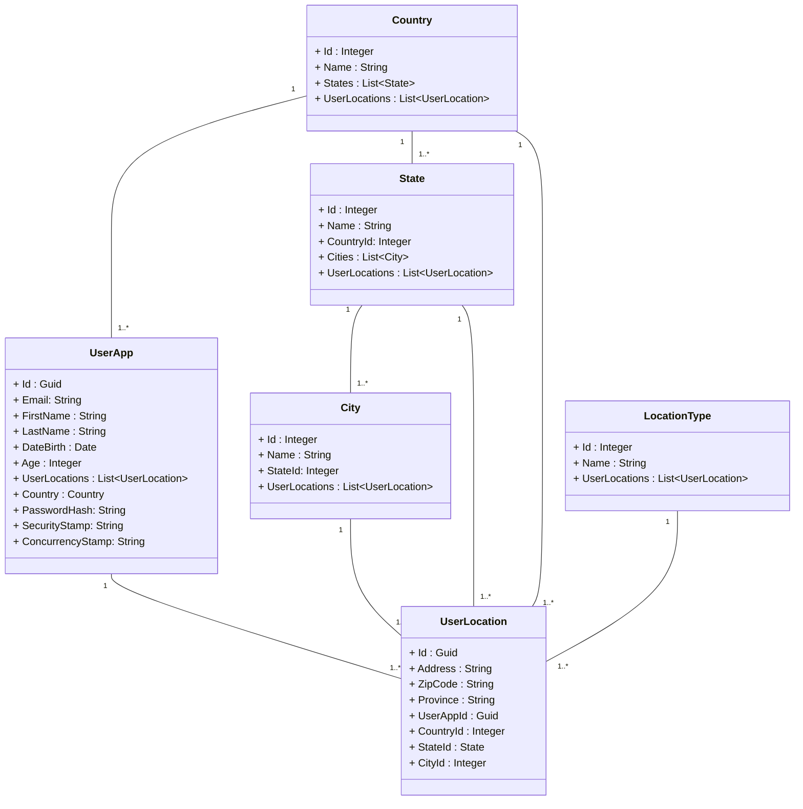

# ClarikaAppService
### Application Developer Interview Test
### Class Diagram proposed 

### 🌍 Countries States Cities Database Integration **API**
- Reference: [API Documentation](https://countrystatecity.in/)
- Demo : https://dr5hn.github.io/countries-states-cities-database/

## Development

Before you can build this project, you must install and configure the following dependencies on your machine:

1. Node.js: We use Node to run a development web server and build the project.
1. 
   
In ./src/ClarikaAppService/ClientApp run

    npm install

### Using angular-cli

You can also use [Angular CLI] to generate some custom client code.

For example, the following command:

    ng generate component my-component

will generate few files:

    create ClarikaAppService/ClientApp/src/app/my-component/my-component.component.html
    create ClarikaAppService/ClientApp/src/app/my-component/my-component.component.ts
    update ClarikaAppService/ClientApp/src/app/app.module.ts

## Code style / formatting

To format the dotnet code, run

    dotnet format

## Testing

To launch your application's tests, run:

    dotnet test --verbosity normal

### Client tests

In ClientApp folder run :

    npm test
