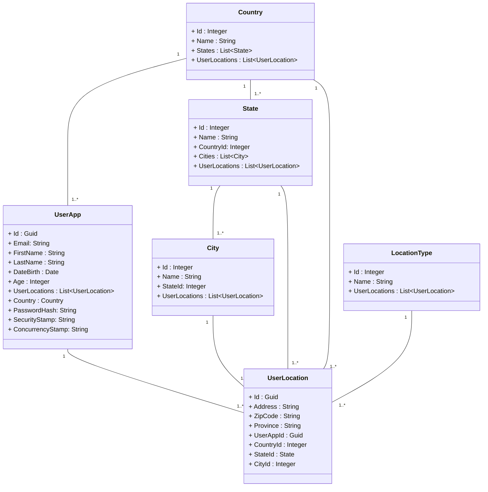

# ClarikaAppService
### Application Developer Interview Test
### Class Diagram proposed 



### 🌍 Countries States Cities Database Integration **API**
- Reference: [API Documentation](https://countrystatecity.in/)
- Demo : https://dr5hn.github.io/countries-states-cities-database/

## Development

Before you can build this project, you must install and configure the following dependencies on your machine:

1. [Node.js][]: We use Node to run a development web server and build the project.
   Depending on your system, you can install Node either from source or as a pre-packaged bundle.

After installing Node, you should be able to run the following command to install development tools.
You will only need to run this command when dependencies change in [package.json](package.json).

In ./src/ClarikaAppService/ClientApp run

    npm install

We use npm scripts and [Webpack][] as our build system.

Run the following commands in two separate terminals to create a blissful development experience where your browser
auto-refreshes when files change on your hard drive.

    dotnet run --verbosity normal --project ./src/ClarikaAppService/ClarikaAppService.csproj
    npm --prefix ./src/ClarikaAppService/ClientApp start

npm is also used to manage CSS and JavaScript dependencies used in this application. You can upgrade dependencies by
specifying a newer version in [package.json](package.json). You can also run `npm update` and `npm install` to manage dependencies.
Add the `help` flag on any command to see how you can use it. For example, `npm help update`.

The `npm --prefix ./src/ClarikaAppService/ClientApp run` command will list all of the scripts available to run for this project.

### Managing dependencies

For example, to add [Leaflet][] library as a runtime dependency of your application, you would run following command:

    npm --prefix ./src/ClarikaAppService/ClientApp install --save --save-exact leaflet

To benefit from TypeScript type definitions from [DefinitelyTyped][] repository in development, you would run following command:

    npm --prefix ./src/ClarikaAppService/ClientApp install --save-dev --save-exact @types/leaflet

Then you would import the JS and CSS files specified in library's installation instructions so that [Webpack][] knows about them:
Edit [ClarikaAppService/ClientApp/app/vendor.ts](ClarikaAppService/ClientApp/app/vendor.ts) file:

```
import 'leaflet/dist/leaflet.js';
```

Edit [ClarikaAppService/ClientApp/content/css/vendor.css](ClarikaAppService/ClientApp/content/css/vendor.css) file:

```
@import '~leaflet/dist/leaflet.css';
```

Note: there are still few other things remaining to do for Leaflet that we won't detail here.

### Using angular-cli

You can also use [Angular CLI][] to generate some custom client code.

For example, the following command:

    ng generate component my-component

will generate few files:

    create ClarikaAppService/ClientApp/src/app/my-component/my-component.component.html
    create ClarikaAppService/ClientApp/src/app/my-component/my-component.component.ts
    update ClarikaAppService/ClientApp/src/app/app.module.ts

## Code style / formatting

To format the dotnet code, run

    dotnet format

## Testing

To launch your application's tests, run:

    dotnet test --verbosity normal

### Client tests

In ClientApp folder run :

    npm test
