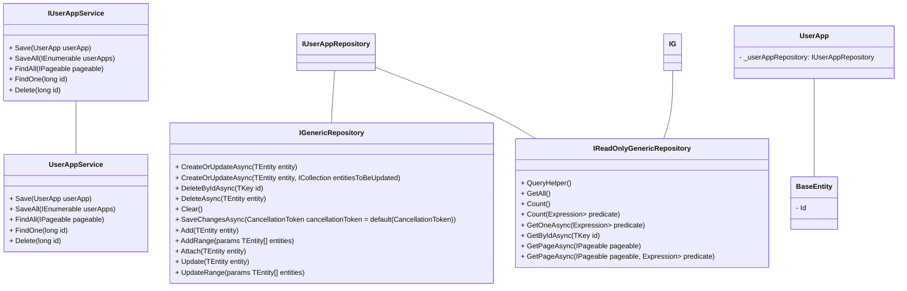

```mermaid
classDiagram
  class IUserAppService {
    + Save(UserApp userApp)
    + SaveAll(IEnumerable<UserApp> userApps)
    + FindAll(IPageable pageable)
    + FindOne(long id)
    + Delete(long id)
  }

class UserAppService {
    + Save(UserApp userApp)
    + SaveAll(IEnumerable<UserApp> userApps)
    + FindAll(IPageable pageable)
    + FindOne(long id)
    + Delete(long id)
  }

class IUserAppRepository {

  }

class IGenericRepository {
    + CreateOrUpdateAsync(TEntity entity)
    + CreateOrUpdateAsync(TEntity entity, ICollection<Type> entitiesToBeUpdated)
    + DeleteByIdAsync(TKey id)
    + DeleteAsync(TEntity entity)
    + Clear()
    + SaveChangesAsync(CancellationToken cancellationToken = default(CancellationToken))
    + Add(TEntity entity)
    + AddRange(params TEntity[] entities)
    + Attach(TEntity entity)
    + Update(TEntity entity)
    + UpdateRange(params TEntity[] entities)
  }
 

class IReadOnlyGenericRepository {
    + QueryHelper()
    + GetAll()
    + Count()
    + Count(Expression<Func<TEntity, bool>> predicate)
    + GetOneAsync(Expression<Func<TEntity, bool>> predicate)
    + GetByIdAsync(TKey id)
    + GetPageAsync(IPageable pageable)
    + GetPageAsync(IPageable pageable, Expression<Func<TEntity, bool>> predicate)
  }

  
  class UserApp {
    - _userAppRepository: IUserAppRepository
  }

  class BaseEntity {
    - Id
  }

  IUserAppService -- UserAppService
  IUserAppRepository -- IGenericRepository
  IUserAppRepository -- IReadOnlyGenericRepository
  IG -- IReadOnlyGenericRepository
  UserApp -- BaseEntity


```
